<h2>TensorFlow-FlexUNet-Image-Segmentation-Multiclass-Brain-Hemorrhage (2025/11/06)</h2>

This is the first experiment of Image Segmentation for Multiclass Brain Hemorrhager (MBH),
 based on our 
TensorFlowFlexUNet (TensorFlow Flexible UNet Image Segmentation Model for Multiclass) 
and a 512x512 pixels PNG 
<a href="https://drive.google.com/file/d/1xgEzSQpY-2Dut95WlLmI8Gwr32gQtOcX/view?usp=sharing">
MBH-ImageMask-Dataset.zip,
</a>
which was derived by us from   
<a href=" https://huggingface.co/datasets/WuBiao/BHSD/resolve/main/label_192.zip">
label_192.zip
</a>
in 
<a href="https://huggingface.co/datasets/Wendy-Fly/BHSD">
<b>
MBH: Multi-class Brain Hemorrhage Segmentation in Non-conrast CT</b>
</a>
 

<b>Acutual Image Segmentation for 512x512 pixels Brain-Hemorrhage Images</b> 
As shown below, the inferred masks predicted by our segmentation model trained on the 
PNG dataset appear similar to the ground truth masks, but they lack precision in certain areas. 
<b>rgb_map ( EDH:red,    IPH:blue    IVH:yellow     SAH:cyan,   SDH:green) </b>
 
<table>
<tr>
<th>Input: image</th>
<th>Mask (ground_truth)</th>
<th>Prediction: inferred_mask</th>
</tr>
<tr>
<td></td>
<td>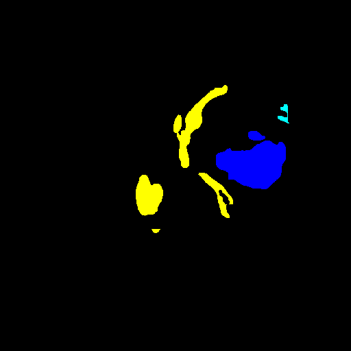</td>
<td>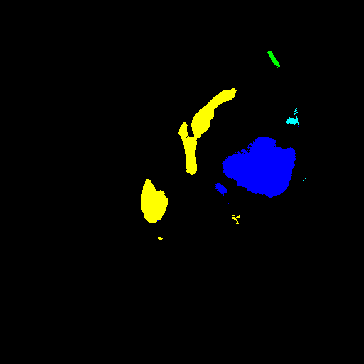</td>
</tr>
<tr>
<td>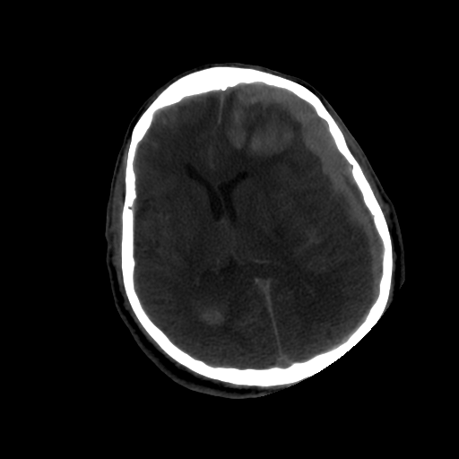</td>
<td>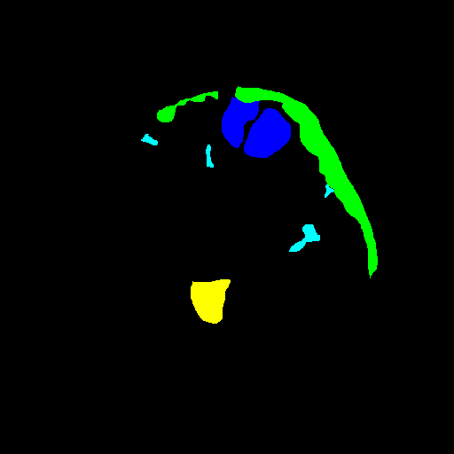</td>
<td>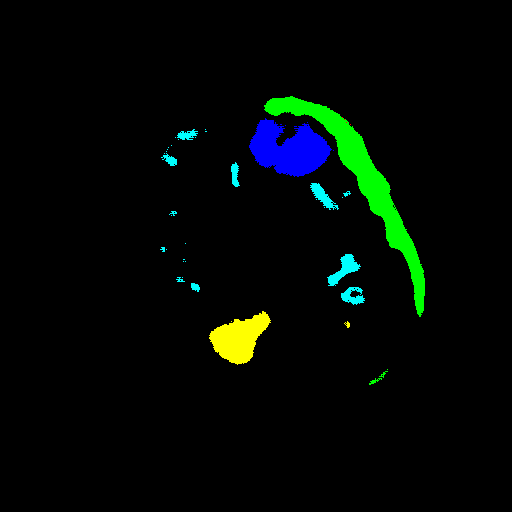</td>
</tr>
<tr>
<td>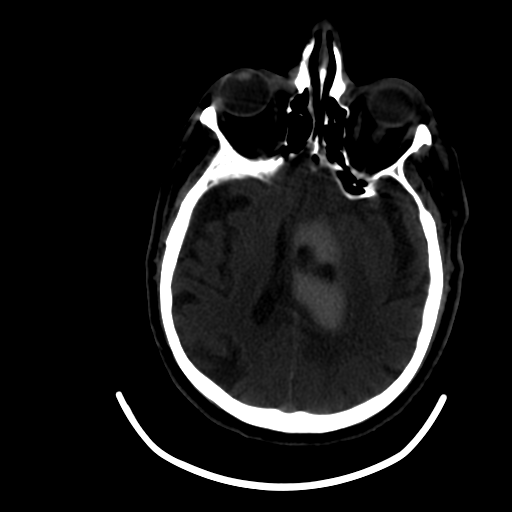</td>
<td></td>
<td>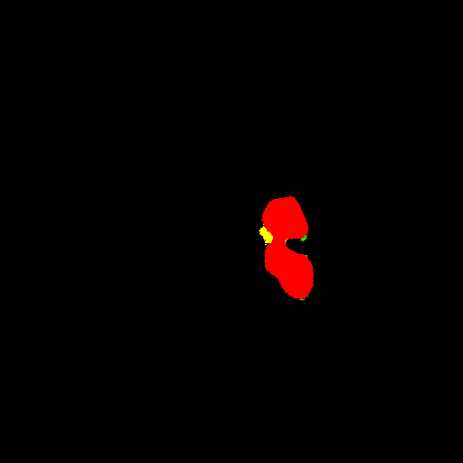</td>
</tr>
</table>

<h3>1. Dataset Citation</h3>
The dataset used was derivied from:  
<a href=" https://huggingface.co/datasets/WuBiao/BHSD/resolve/main/label_192.zip">
label_192.zip
</a>
in 
<a href="https://huggingface.co/datasets/Wendy-Fly/BHSD">
<b>
MBH: Multi-class Brain Hemorrhage Segmentation in Non-conrast CT</b>
</a>
 
 
<a href="https://github.com/White65534/BHSD/tree/2ec4322a5a644494a312df891a3089bbf74c136a">
BHSD: A 3D Multi-class Brain Hemorrhage Segmentation Dataset
</a>
 
Authors: Biao Wu, Yutong Xie, Zeyu Zhang, Jinchao Ge, Kaspar Yaxley, Suzan Bahadir, Qi Wu, Yifan Liu, Minh-Son To 
 
<b>Description</b> 
Intracranial hemorrhage (ICH) is a pathological condition characterized by bleeding inside the skull or brain,
 which can be attributed to various factors. Identifying, localizing and quantifying ICH has important clinical 
 implications, in a bleed-dependent manner. 
  While deep learning techniques are widely used in medical image segmentation and have been applied to the ICH segmentation task,
   existing public ICH datasets do not support the multi-class segmentation problem. To address this, 
   we develop the Brain Hemorrhage Segmentation Dataset (BHSD), which provides a 3D multi-class ICH dataset containing 192 
   volumes with pixel-level annotations and 2200 volumes with slice-level annotations across five categories of ICH.  
   To demonstrate the utility of the dataset, we formulate a series of supervised and semi-supervised ICH segmentation tasks. 
  We provide experimental results with state-of-the-art models as reference benchmarks for further model developments and evaluations 
  on this dataset.
  
<b>Citation</b> 
<pre style="font-family: Consolas, 'Courier New', Courier, Monaco, monospace; font-size: 16px;">
@inproceedings{wu2023bhsd,
  title={BHSD: A 3D Multi-class Brain Hemorrhage Segmentation Dataset},
  author={Wu, Biao and Xie, Yutong and Zhang, Zeyu and Ge, Jinchao and Yaxley, Kaspar and Bahadir, Suzan and Wu, Qi and Liu, Yifan and To, Minh-Son},
  booktitle={International Workshop on Machine Learning in Medical Imaging},
  pages={147--156},
  year={2023},
  organization={Springer}
}
</pre>
 
<b>Licence</b> 
<a href="https://www.mit.edu/~amini/LICENSE.md">MIT</a>
 
 
Please see also kaggle web-site <a href="https://www.kaggle.com/datasets/hoangxuanviet/multiclass-brain-hemorrhage-segmentation/data">
Multiclass Brain Hemorrhage Segmentation
</a>
 
 
<h3>
<a id="2">
2 MBH ImageMask Dataset
</a>
</h3>
<h4>2.1 Download ImageMask Dataset</h4>
 If you would like to train this MBH Segmentation model by yourself,
 please download the dataset from the google drive 
<a href="https://drive.google.com/file/d/1xgEzSQpY-2Dut95WlLmI8Gwr32gQtOcX/view?usp=sharing">
MBH-ImageMask-Dataset.zip</a>.
 
, expand the downloaded ImageMaskDataset and put it under <b>./dataset</b> folder to be
<pre>
./dataset
└─MBH
    ├─test
    │   ├─images
    │   └─masks
    ├─train
    │   ├─images
    │   └─masks
    └─valid
        ├─images
        └─masks
</pre>
 
<b>MBH Statistics</b> 
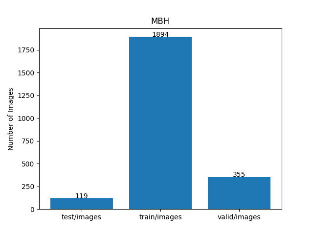 
 
As shown above, the number of images of train and valid datasets is not so large to use for a training set of our segmentation model.
 
 
<h4>2.2 PNG ImageMask Dataset Derivation</h4>
We used the following two Python scripts to derive our PNG dataset from the 
<a href=" https://huggingface.co/datasets/WuBiao/BHSD/resolve/main/label_192.zip">
label_192.zip
</a>
<ul>
<li><a href="./generator/MBHImageMaskDatasetGenerator.py">MBHImageMaskDatasetGenerator.py</a></li>
<li><a href="./generator/split_master.py">split_master.py</a></li>
</ul>
In MBHImageMaskDatasetGenerator.py, we exclude empty black masks and their correspoing images to generate our PNG dataset, 
and used the following category and color mapping table to generate the colorized masks.
You may change this color mappging table in the Python script according to your preference. 
 
<table <table border="1" style="border-collapse: collapse;">
<tr>
<th>Index</th><th>Category</th><th>Color</th><th>BGR triplet</th>
</tr>
<tr><td>1</td><td>EDH(Epidural Hematoma) </td><td>red</td><td>(  0,   0,  255)</td></tr>
<tr><td>2</td><td>IPH(Intraparenchymal Hemorrhage) </td><td>blue</td><td>(255,   0,   0) </td></tr>
<tr><td>3</td><td>IVH(Intraventricular Hemorrhage)</td><td>yellow</td><td>(  0, 255,  255)</td></tr>
<tr><td>4</td><td>SAH(Subarachnoid Hemorrhage) </td><td>cyan</td><td>(255, 255,   0)</td></tr>
<tr><td>5</td><td>SDH(Subdural Hematoma) </td><td>green</td><td>(  0, 255,   0)</td></tr>

</table>
<h4>2.3 Train Images and Masks Sample</h4>

<b>Train_images_sample</b> 
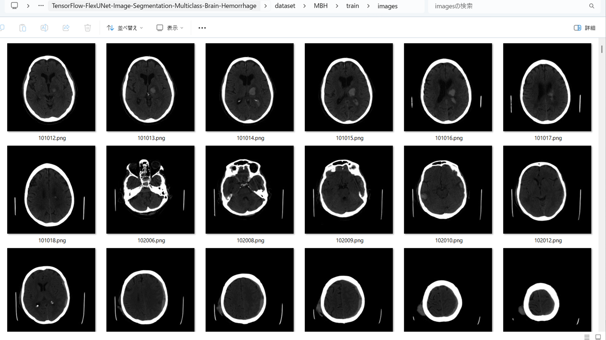
 
<b>Train_masks_sample</b> 
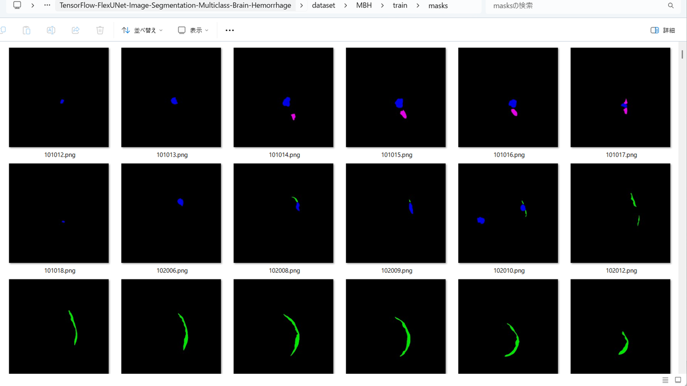
 
 
<h3>
3 Train TensorFlowFlexUNet Model
</h3>
 We trained MBH TensorFlowFlexUNet Model by using the following
<a href="./projects/TensorFlowFlexUNet/MBH/train_eval_infer.config"> <b>train_eval_infer.config</b></a> file.  
Please move to ./projects/TensorFlowFlexUNet/MBH and run the following bat file. 
<pre>
>1.train.bat
</pre>
, which simply runs the following command. 
<pre>
>python ../../../src/TensorFlowFlexUNetTrainer.py ./train_eval_infer.config
</pre>

<b>Model parameters</b> 
Defined a small <b>base_filters = 16 </b> and large <b>base_kernels = (7,7)</b> for the first Conv Layer of Encoder Block of 
<a href="./src/TensorFlowFlexUNet.py">TensorFlowFlexUNet.py</a> 
and a large num_layers (including a bridge between Encoder and Decoder Blocks).
<pre>
[model]
;You may specify your own UNet class derived from our TensorFlowFlexModel
model         = "TensorFlowFlexUNet"
generator     =  False
image_width    = 512
image_height   = 512
image_channels = 3
num_classes    = 6

base_filters   = 16
base_kernels   = (7,7)
num_layers     = 8
dropout_rate   = 0.05
dilation       = (1,1)
</pre>
<b>Learning rate</b> 
Defined a very small learning rate.  
<pre>
[model]
learning_rate  = 0.00005
</pre>
<b>Loss and metrics functions</b> 
Specified "categorical_crossentropy" and <a href="./src/dice_coef_multiclass.py">"dice_coef_multiclass"</a>. 
<pre>
[model]
loss           = "categorical_crossentropy"
metrics        = ["dice_coef_multiclass"]
</pre>
<b>Dataset class</b> 
Specifed <a href="./src/ImageCategorizedMaskDataset.py">ImageCategorizedMaskDataset</a> class. 
<pre>
[dataset]
class_name    = "ImageCategorizedMaskDataset"
</pre>
 
<b>Learning rate reducer callback</b> 
Enabled learing_rate_reducer callback, and a small reducer_patience.
<pre> 
[train]
learning_rate_reducer = True
reducer_factor     = 0.5
reducer_patience   = 4
</pre>
<b>Early stopping callback</b> 
Enabled early stopping callback with patience parameter.
<pre>
[train]
patience      = 10
</pre>

<b>RGB Color map</b> 
rgb color map dict for MBH 1+5 classes. 
<pre>
[mask]
mask_file_format = ".png"
;                     EDH:red,    IPH:blue    IVH:yellow     SAH:cyan,   SDH:green
rgb_map = {(0,0,0):0,(255,0,0):1,(0,0,255):2, (255,255,0):3, (0,255,255):4,(0,255,0):5}
</pre>

<b>Epoch change inference callback</b> 
Enabled <a href="./src/EpochChangeInfereuncer.py">epoch_change_infer callback</a></b>. 
<pre>
[train]
epoch_change_infer       = True
epoch_change_infer_dir   =  "./epoch_change_infer"
num_infer_images         = 6
</pre>

By using this callback, on every epoch_change, the inference procedure can be called
 for 6 images in <b>mini_test</b> folder. This will help you confirm how the predicted mask changes 
 at each epoch during your training process.    

<b>Epoch_change_inference output at starting (epoch 1,2,3)</b> 
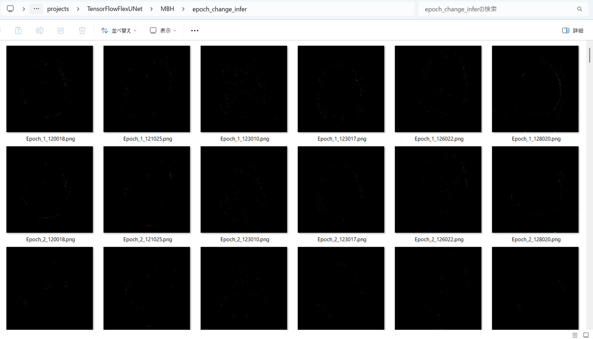 
 
<b>Epoch_change_inference output at middlepoint (epoch 25,26,27)</b> 
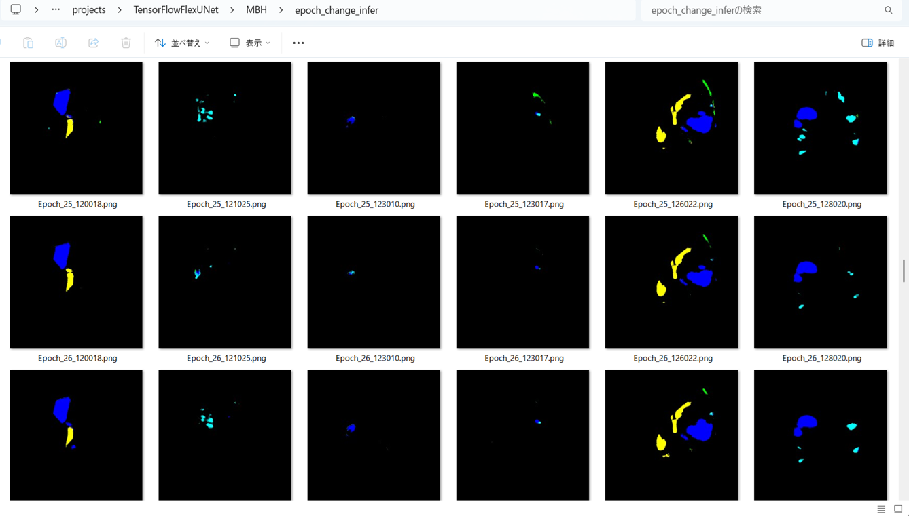 
 
<b>Epoch_change_inference output at ending (epoch 51,52,53)</b> 
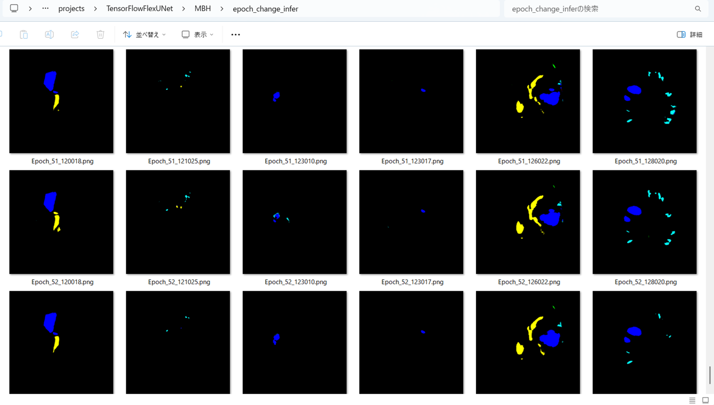 
 
In this experiment, the training process was stopped at epoch 53 by EearlyStopping callback.  
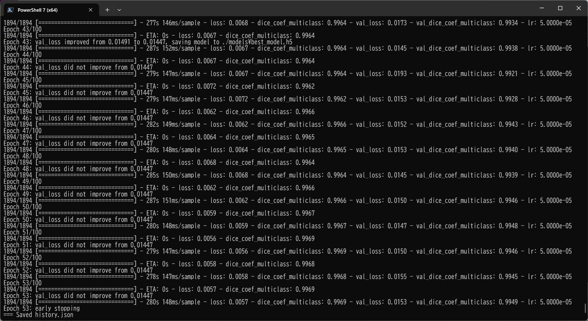 
 

<a href="./projects/TensorFlowFlexUNet/MBH/eval/train_metrics.csv">train_metrics.csv</a> 
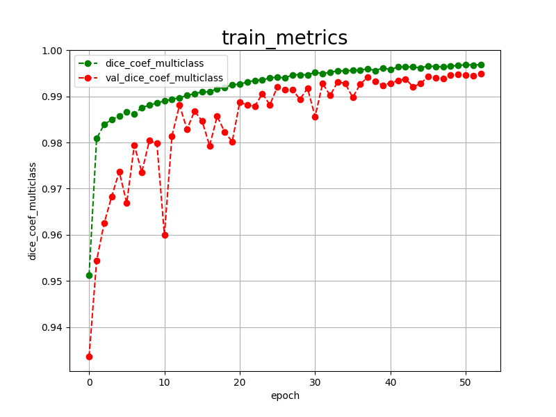 

 
<a href="./projects/TensorFlowFlexUNet/MBH/eval/train_losses.csv">train_losses.csv</a> 
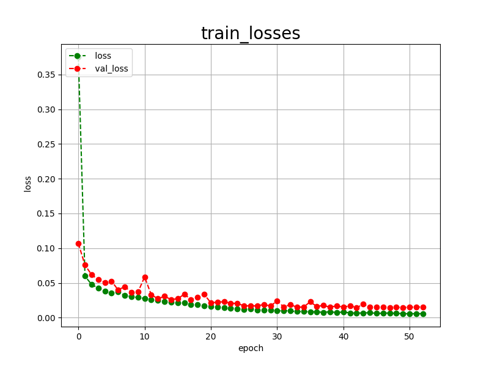 

 

<h3>
4 Evaluation
</h3>
Please move to <b>./projects/TensorFlowFlexUNet/MBH</b> folder, 
and run the following bat file to evaluate TensorFlowFlexUNet model for MBH. 
<pre>
./2.evaluate.bat
</pre>
This bat file simply runs the following command.
<pre>
python ../../../src/TensorFlowFlexUNetEvaluator.py ./train_eval_infer_aug.config
</pre>

Evaluation console output: 
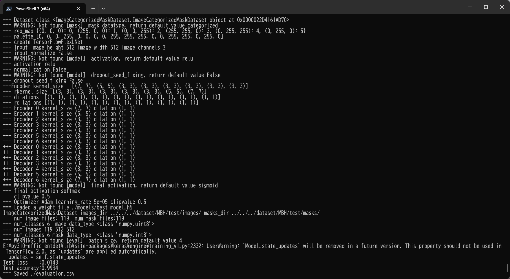
  

<a href="./projects/TensorFlowFlexUNet/MBH/evaluation.csv">evaluation.csv</a> 
The loss (categorical_crossentropy) to this MBH/test was low and dice_coef_multiclass 
high as shown below.
 
<pre>
categorical_crossentropy,0.0143
dice_coef_multiclass,0.9934
</pre>
 

<h3>
5 Inference
</h3>
Please move <b>./projects/TensorFlowFlexUNet/MBH</b> folder 
,and run the following bat file to infer segmentation regions for images by the Trained-TensorFlowFlexUNet model for MBH. 
<pre>
./3.infer.bat
</pre>
This simply runs the following command.
<pre>
python ../../../src/TensorFlowFlexUNetInferencer.py ./train_eval_infer_aug.config
</pre>

<b>mini_test_images</b> 
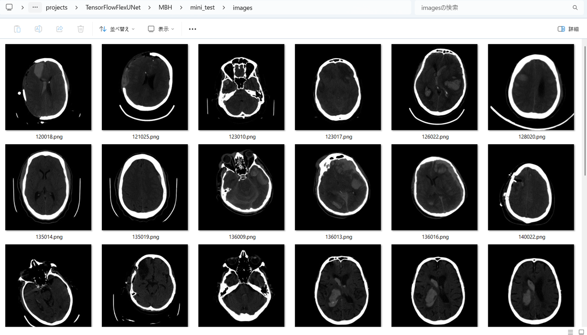 
<b>mini_test_mask(ground_truth)</b> 
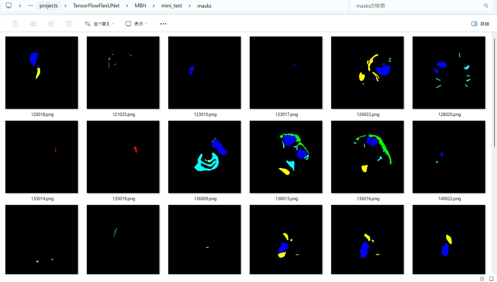 

<b>Inferred test masks</b> 
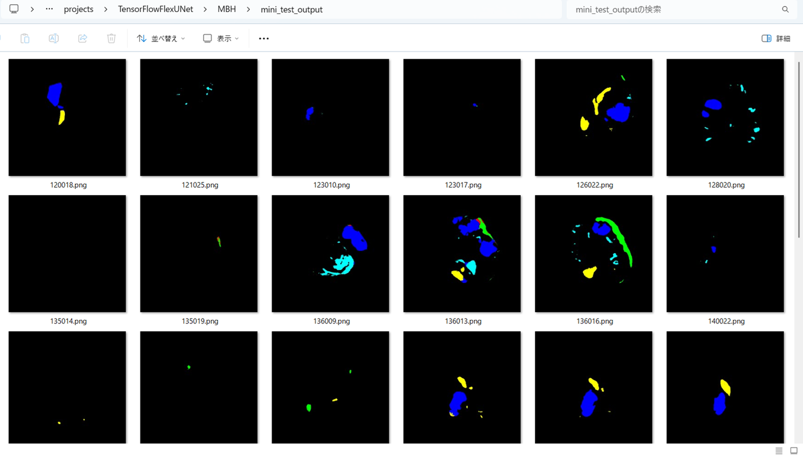 
 

<b>Enlarged images and masks of 512x512 pixels Brain Hemmorrhage Images</b> 
As shown below, this semgentation model failed to segment EDH (red) region in the 4th case. 
<b>rgb_map (EDH:red,    IPH:blue    IVH:yellow     SAH:cyan,   SDH:green)</b> 
<table>
<tr>
<th>Image</th>
<th>Mask (ground_truth)</th>
<th>Inferred-mask</th>
</tr>

<tr>
<td>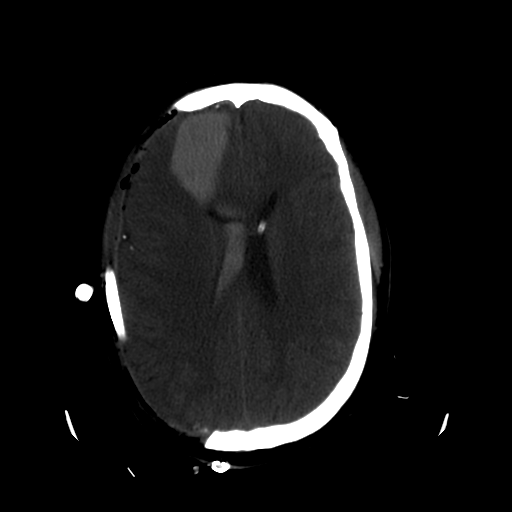</td>
<td>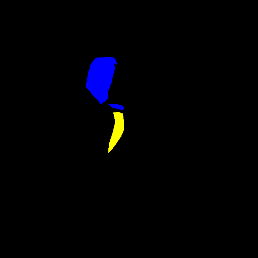</td>
<td>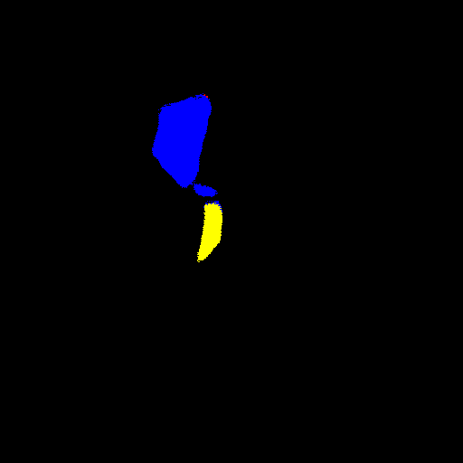</td>
</tr>

<tr>
<td>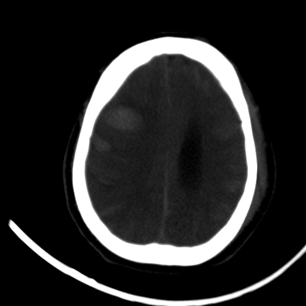</td>
<td>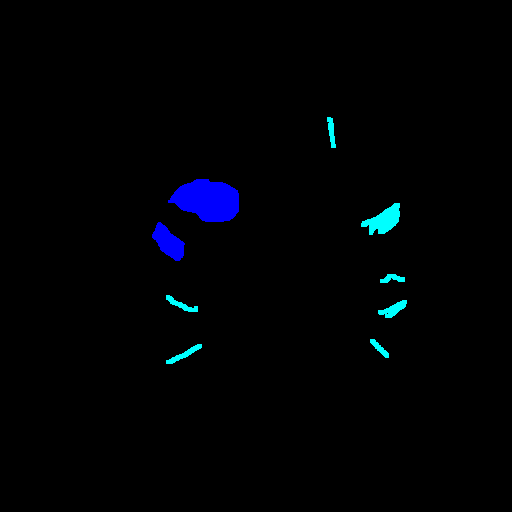</td>
<td>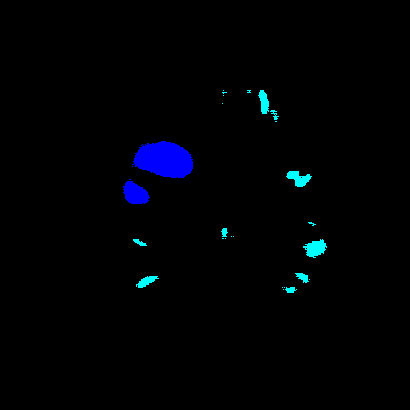</td>
</tr>

<tr>
<td>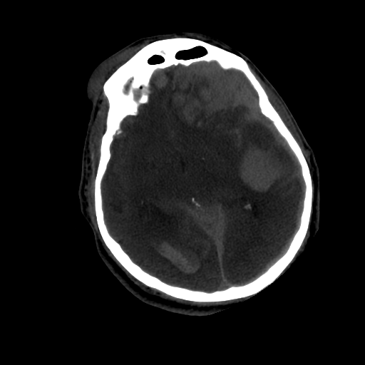</td>
<td>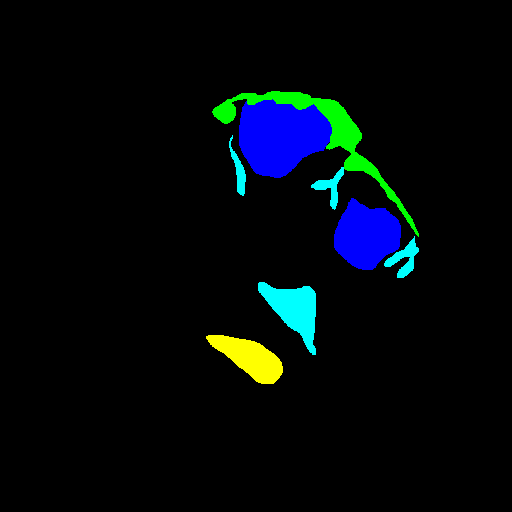</td>
<td>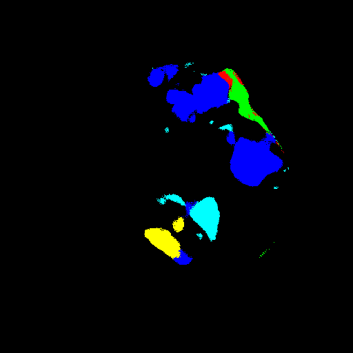</td>
</tr>

<tr>
<td>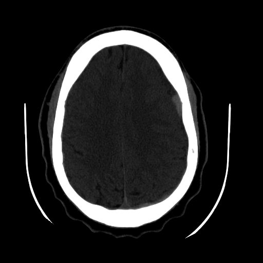</td>
<td></td>
<td>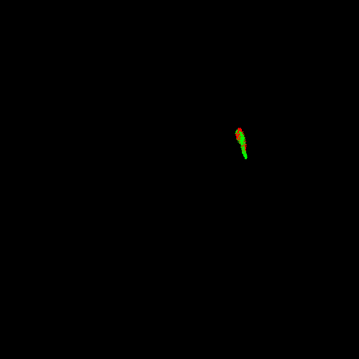</td>
</tr>

<tr>
<td>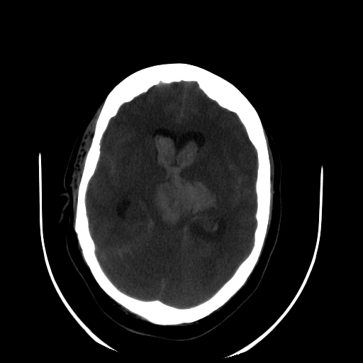</td>
<td>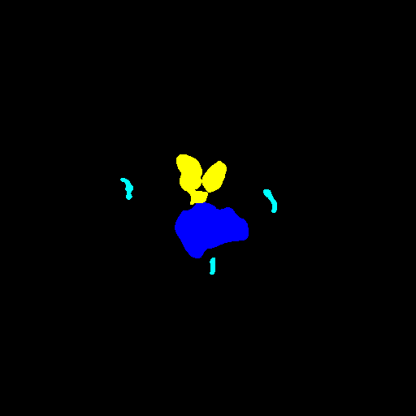</td>
<td></td>
</tr>

<tr>
<td>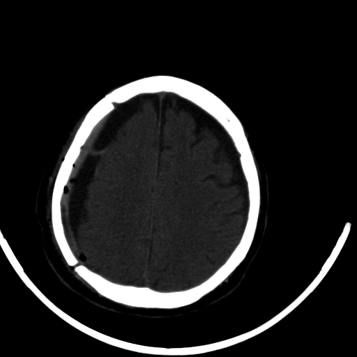</td>
<td>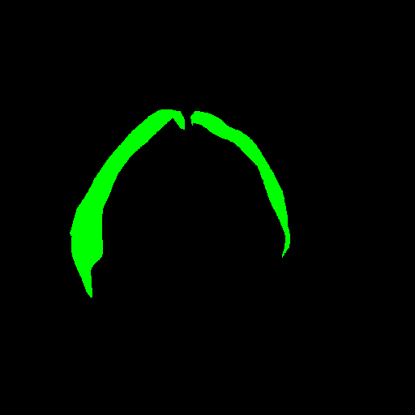</td>
<td>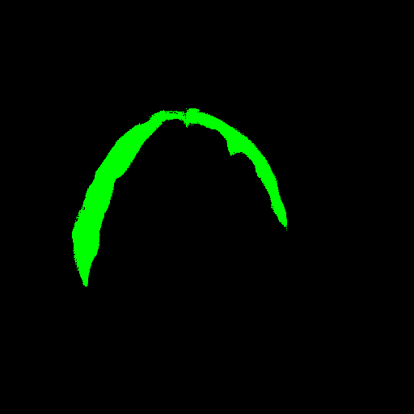</td>
</tr>
</table>

 
<h3>
References
</h3>

<b>1. BHSD: A 3D Multi-class Brain Hemorrhage Segmentation Dataset</b> 
Biao Wu, Yutong Xie, Zeyu Zhang, Jinchao Ge, Kaspar Yaxley, Suzan Bahadir, Qi Wu, Yifan Liu, Minh-Son To 
<a href="https://github.com/White65534/BHSD/tree/2ec4322a5a644494a312df891a3089bbf74c136a">
https://github.com/White65534/BHSD/tree/2ec4322a5a644494a312df891a3089bbf74c136a
</a>
 
 

<b>2. BHSD: A 3D Multi-Class Brain Hemorrhage Segmentation Dataset</b> 
Biao Wu, Yutong Xie, Zeyu Zhang, Jinchao Ge, Kaspar Yaxley, Suzan Bahadir, Qi Wu, Yifan Liu, Minh-Son To 
<a href="https://arxiv.org/pdf/2308.11298">https://arxiv.org/pdf/2308.11298</a>
 
 
<b>3. Advanced multi-label brain hemorrhage segmentation using an attention-based residual U-Net model</b> 
Xinxin Lin, Enmiao Zou, Wenci Chen, Xinxin Chen, Le Lin 
<a href="https://bmcmedinformdecismak.biomedcentral.com/articles/10.1186/s12911-025-03131-3">
https://bmcmedinformdecismak.biomedcentral.com/articles/10.1186/s12911-025-03131-3</a>
 
 
<b>4. TensorFlow-FlexUNet-Image-Segmentation-Model</b> 
Toshiyuki Arai antillia.com  
<a href="https://github.com/sarah-antillia/TensorFlow-FlexUNet-Image-Segmentation-Model">
https://github.com/sarah-antillia/TensorFlow-FlexUNet-Image-Segmentation-Model
</a>
 
 

